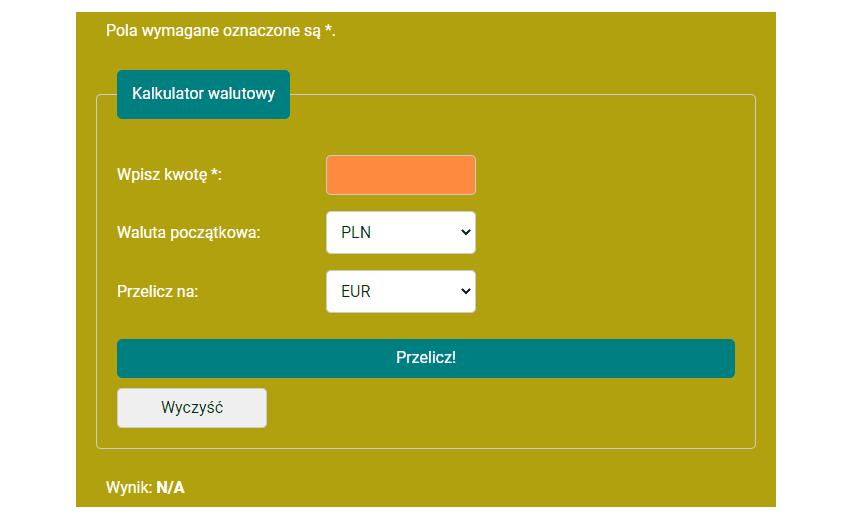

# Kantor wymiany walut

## Demo

https://radoslawbuk.github.io/kantor/

## Opis

Prosty kantor wymiany czterech walut: PLN, USD, EUR oraz GBD. Zaprojektowany z użyciem htmla, CSSa oraz JS. Kurs wymiany poszczególnych walut jest ustawiony sztywno jako określona stała. Przeliczanie kursu odbywa się z użyciem podwójnego switcha. Wynik zaokrąglany jest do dwóch miejsc po przecinku. Można skorzystać z przycisku czyszczącego wprowadzoną liczbę.  
